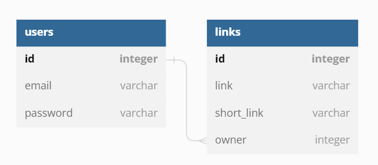
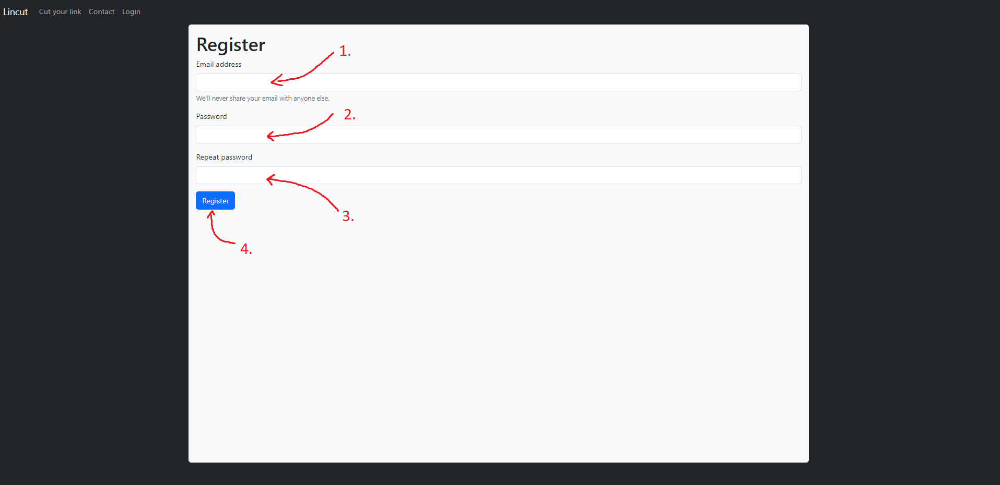
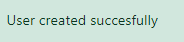
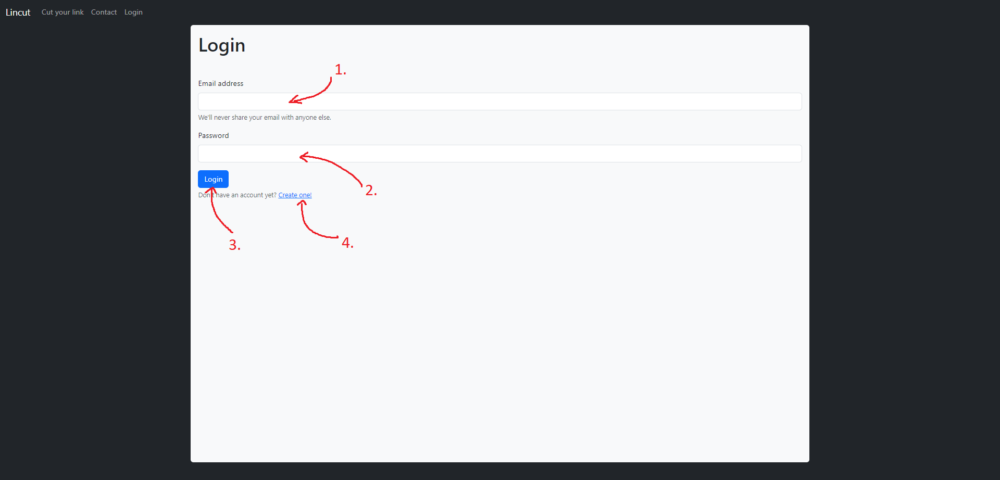
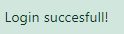
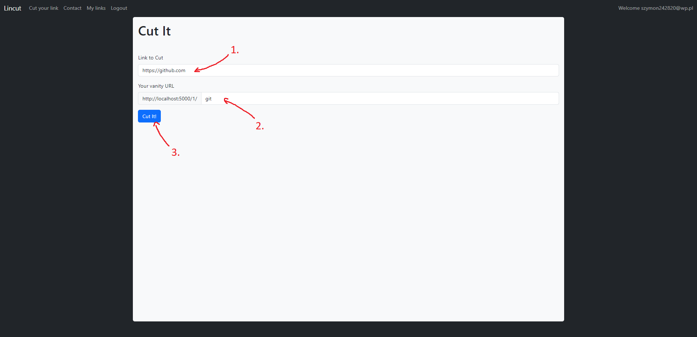
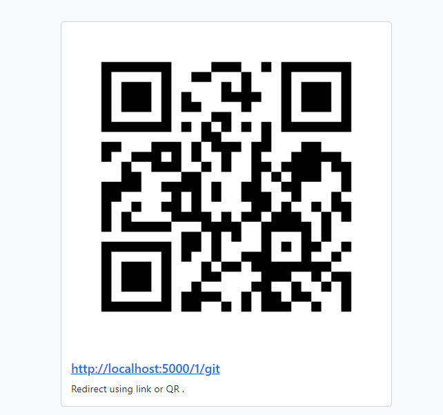
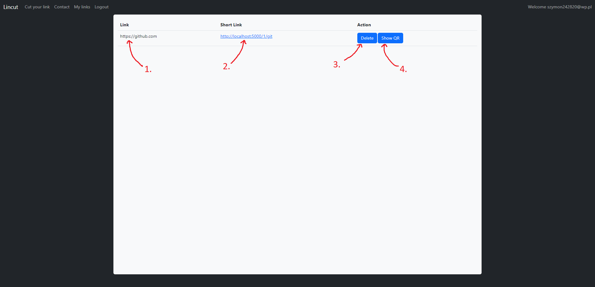
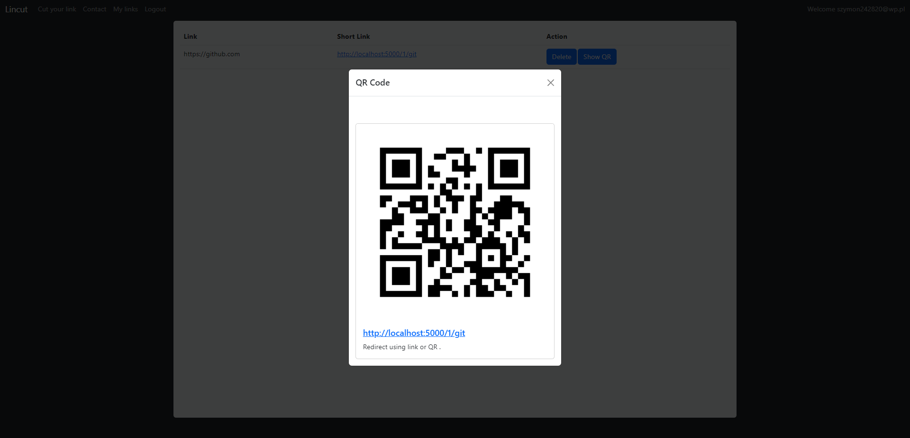

# Aplikacja przeglądarkowa we Flasku - Lincut - skracacz linków

## Spis treści

- [1. Wstęp](#1-wstęp)
    - [1.1. Czym jest Flask](#11-czym-jest-flask)
    - [1.2. Opis zadania](#12-opis-zadania)
- [2. Aplikacja](#2-aplikacja)
    - [2.1. Główne założenia projektu Lincut](#21-główne-założenia-projektu-lincut)
    - [2.2. Modele i baza danych](#22-modele-i-baza-danych)
    - [2.3. Konteneryzacja](#23-konteneryzacja)
    - [2.4. Rejestracja i autoryzacja](#24-rejestracja-i-autoryzacja)
    - [2.5. Skracanie linków i generowanie kodów QR](#25-skracanie-linków-i-generowanie-kodów-qr)
    - [2.6. Przekerowania do zewnętrznych adresów z użyciem skróconych linków](#26-przekierowania-do-zewnętrzych-adresów-z-użyciem-skróconych-linków)
    - [2.7. Zarządzanie stworzonymi skrótami](#27-zarządzanie-stworzonymi-skrótami)
- [3. Poradnik dla użytkownika](#3-poradnik-dla-użytkownika)
    - [3.1. Rejestracja](#31-rejestracja)
    - [3.2. Logowanie](#32-logowanie)
    - [3.3. Skracanie linków](#33-skracanie-linków)
    - [3.4. Zarządzanie stworzonymi skrótami](#34-zarządzanie-stworzonymi-skrótami)
- [4. Podsumowanie](#4-podsumowanie)
    - [4.1. Osiągnięte cele](#41-osiągnięte-cele)
    - [4.2. Napotkane problemy](#42-napotkane-problemy)

# 1. Wstęp

## 1.1. Czym jest Flask

Flask to lekki framework aplikacji webowych napisany w języku Python. Jest to popularne narzędzie wykorzystywane do tworzenia serwerów internetowych, API i aplikacji internetowych. Flask jest zaprojektowany tak, aby był prosty w użyciu i elastyczny, dając programistom swobodę w budowaniu różnego rodzaju aplikacji. 

Główne cechy Flaska to:
- Minimalizm: Flask jest minimalistycznym frameworkiem, który skupia się na podstawowych funkcjach. Nie narzuca konkretnych narzędzi lub bibliotek, co daje programistom większą kontrolę nad tym, jak budować aplikację.
- Mikro-framework: Flask jest często nazywany mikro-frameworkiem, ponieważ oferuje tylko podstawowe funkcje, takie jak obsługa trasowania URL-i, obsługa żądań HTTP i renderowanie szablonów. Nie ma wbudowanych warstw abstrakcji, co umożliwia programistom większą elastyczność i swobodę w budowaniu aplikacji według ich preferencji.
- Rozszerzalność: Flask jest bardzo rozszerzalny i umożliwia programistom dodawanie dodatkowych funkcjonalności poprzez tzw. rozszerzenia. Istnieje wiele rozszerzeń dostępnych dla Flaska, które ułatwiają obsługę uwierzytelniania, obsługę baz danych, walidację formularzy i wiele innych.
- Wbudowany serwer developerski: Flask ma wbudowany serwer developerski, co oznacza, że ​​możesz łatwo uruchamiać i testować swoje aplikacje bez konieczności konfigurowania oddzielnego serwera HTTP.

## 1.2. Opis zadania

Celem zadania jest stworzenie dynamicznej strony internetowej opartej na bibliotece Flask. Do wymaganych funkcjonalności należą:
- formularz z danymi zapisywanymi do bazy danych,
- osadzone elementy multimedialne,
- przynajmniej dwie podstrony

# 2. Aplikacja

## 2.1. Główne założenia projektu Lincut

Projekt ***Lincut*** zakłada stworzenie, a następnie udostępnienie dla szerzego grona użytkowników narzędzia, które pozwoli na skracanie adresów URL do prostszej do zapamiętania i udostępnienia formy. Produkt będzie pozwalał na:
- zarejestrowanie konta użytkownika,
- tworzenie skróconych adresów URL,
- przekierowywanie użytkowników na zewnętrzne strony internetowe z użyciem skrócoych adresów URL.

## 2.2. Modele i baza danych

W projekcie występują dwa modele: Użytkownik (User) oraz Link. Implementacja tych modeli w kodzie aplikacji wygląda następująco:

```python
class User(db.Model):
    id = db.Column(db.Integer, primary_key=True)
    email = db.Column(db.String(50), unique=True, nullable=False)
    password = db.Column(db.String(255), nullable=False)
    links = db.relationship('Link', lazy='select', backref=db.backref('user', lazy='joined'))

    def __init__(self, email, password):
        self.email = email
        self.password = password


class Link(db.Model):
    id = db.Column(db.Integer, primary_key=True)
    link = db.Column(db.String(255), nullable=False)
    short_link = db.Column(db.String(20), nullable=False)
    owner = db.Column(db.Integer, db.ForeignKey('user.id'), nullable=False)

    def __init__(self, link, short_link, owner):
        self.link = link
        self.short_link = short_link
        self.owner = owner
```

Zostały stworzone przy użyciu klasy ``SQLAlchemy`` z pakietu ``flask_sqlalchemy``. Jak można zauważyć oba modele są ze sobą powiązane relacją. Każdy Link posiada swojego właściciela, a pobranie Użytkownika z bazy danych poskutkuje również pobraniem wszystkich Linków, które zostały przez niego skrócone i zapisane w bazie danych.



Baza danych, z którą aplikacja jest powiązana, znajduje się na kontenerze Dockera. Więcej informacji o dockeryzacji zostanie uwzględnione w następnym podroździale. 

## 2.3. Konteneryzacja

W celu złączenia projektu do postaci obrazu użyliśmy narzędzia Docker. Aby powstał obraz aplikacji Lincut należało stworzyć plik ``Dockerfile``, w którym zostały uwzględnione wszystkie kolejne kroki, które były potrzebne do stworzenia obrazu.

```Dockerfile
FROM python:3.11.3

WORKDIR /app
COPY /flask_app /flask_app

RUN pip install --no-cache-dir -r /flask_app/requirements.txt

EXPOSE 5000

CMD ["python", "/flask_app/__init__.py"]
```

Następnie w celu stworzenia działającej wównorzędnie z aplikacją bazy danych stworzyliśmy plik ``docker-compose.yml``, w którym zawarliśmy pełną strukturę projektu.

```yml
version: '3'
services:
  app:
    build: .
    ports:
      - 5000:5000
    depends_on:
      - db
    networks:
      - mynetwork
  db:
    image: mysql:latest
    restart: always
    environment:
      MYSQL_ROOT_PASSWORD: root
      MYSQL_DATABASE: flaskapp
      MYSQL_USER: dbusr
      MYSQL_PASSWORD: passwd
    ports:
      - 3306:3306
    volumes:
      - db_data:/var/lib/mysql
    networks:
      - mynetwork
networks:
  mynetwork:
volumes:
  db_data:
```

Zawarte w ``docker-compose.yml`` informacje na temat konfiguracji bazy danych zostały uwzględnione w kodzie projektu, podczas konfiguracji połączenia z bazą danych:

```python
app.config['SQLALCHEMY_DATABASE_URI'] = 'mysql://dbusr:passwd@db:3306/flaskapp'
```

Z racji tego, że kod jezyka Python jest łatwy do odczytu, w warunkach produkcyjnych nie należy zapisywać poufnych danych takich jak hasło do bazy danych bezpośrednio w kodzie. Można np. stworzyć skrypt bash, który doda hasło jako zmienną do powłoki, a następnie skrypt zostanie usunięty z maszyny. W kodzie źródłowym projektu będą znajdować się jedynie odwołania do zmiennej zapisanej w powłoce.

## 2.4. Rejestracja i autoryzacja

W celu rozróżnienia właścicieli skróconych linków oraz umożliwienia użytkownikom używania podobnych fraz jako rozróżnialna część skróconego linku zdecydowaliśmy się zaimplementować w systemie funkcję rejestracji oraz logowania i wylogowywania się.

Implementacja tych metod znajduje się poniżej:

```python
@app.route("/register", methods=["POST", "GET"])
def register():
    if request.method == "POST":
        email = request.form['email']
        password = request.form['password']
        password_repeat = request.form['passwordRepeat']
        if db.session.query(User).filter_by(email=email).first():
            flash("User with that email already exist.", "error")
            return(redirect(url_for("register")))
        elif password != password_repeat:
            flash("Passwords are not the same.", "error")
            return(redirect(url_for("register")))
        else:
            user = User(
                email=email,
                password=hashlib.md5(password.encode()).hexdigest()
            )
            db.session.add(user)
            db.session.commit()
            flash("User created succesfully", "success")
            return redirect(url_for("login"))
    else:
        return render_template("register.html")


@app.route("/login", methods=["POST", "GET"])
def login():
    if request.method == "POST":
        email = request.form["email"]
        password = request.form["password"]
        db_user = db.session.query(User).filter_by(email=email).first()
        if db_user:
            if hashlib.md5(password.encode()).hexdigest() == db_user.password:
                session.permanent = True
                session["authusr"] = email
                flash("Login succesfull!", "success")
                return redirect(url_for("cutit"))
            else:
                flash("Wrong password!", "error")
                return redirect(url_for("login"))
        flash("User with that email doesnt exist", "error")
        return redirect(url_for("login"))
    else:
        return render_template("login.html")
    

@app.route("/logout")
def logout():
    flash("You have been logged out!", "info")
    session.pop("authusr", None)
    return redirect(url_for("login"))
```

Jak widać w celu ochrony danych zdecydowaliśmy się nie przechowywać haseł użytkowników w ich bezpośredniej formie, a jedynie ``HashMD5`` tego hasła. Autoryzacja również polega na hashowaniu podanego podczas logowania przez użytkownika hasła i porównywania go z wyciągniętym z bazy danych odpowiednikiem dla podanego emaila.

## 2.5. Skracanie linków i generowanie kodów QR

Każdy zalogowany użytkownik ma możliwość stworzenia skróconego linku. Skrócony link zostanie stworzony, zapisany do bazy danych, a następnie przy użyciu pakietu ``qrcode`` zostanie wygenerowany kod QR, który zapisany w formacie Base64 jest "wstrzykiwany" do warstwy wizualnej strony internetowej. Implementacja takiego rozwiązania wygląda następująco:

```python
def create_qr(full_short_link):
    qr = qrcode.QRCode(
    version=1,
    error_correction=qrcode.constants.ERROR_CORRECT_L,
    box_size=10,
    border=4,
    )
    qr.add_data(full_short_link)
    qr.make(fit=True)
    return qr.make_image(fill_color="black", back_color="white")

def qr_to_base64(qr):
    buffered = BytesIO()
    qr.save(buffered)
    return base64.b64encode(buffered.getvalue()).decode('utf-8')

@app.route("/cutit", methods=["POST", "GET"])
def cutit():
    if "authusr" in session:
        db_usr = db.session.query(User).filter_by(email=session['authusr']).first()
        db_links = [tmp_link for tmp_link in db_usr.links]
        if request.method == "POST":
            form_link = request.form['link']
            form_short_link = request.form['short_link']
            if form_link in [tmp_link.link for tmp_link in db_links]:
                flash("This link was cutted last time", "info")
                link_obj = [tmp_link for tmp_link in db_links if tmp_link.link == form_link][0]
                full_short_link = str(request.root_url + str(db_usr.id) + '/' + link_obj.short_link)
                qr = create_qr(full_short_link)
                return render_template("cutit.html", usrid=db_usr.id, cutted={"qrcode": qr_to_base64(qr), "short_link": full_short_link})
            elif form_short_link in [link.short_link for link in db_links]:
                    flash("You have already created same short link!", "error")
                    return render_template("cutit.html", usrid=db_usr.id)
            else:
                full_short_link = str(request.root_url + str(db_usr.id) + '/' + form_short_link)
                qr = create_qr(full_short_link)
                link_obj = Link(
                    link = form_link,
                    short_link = form_short_link,
                    owner = db_usr.id
                )
                db.session.add(link_obj)
                db.session.commit()
                return render_template("cutit.html", usrid=db_usr.id, cutted={"qrcode": qr_to_base64(qr), "short_link": full_short_link})
        else:
            return render_template("cutit.html", usrid=db_usr.id)
    else:
        return redirect(url_for("login"))
```

Za wyświetlenie kodu QR na stronie tuż po jego wygenerowaniu odpowiada następująca implementacja w warstwie wizualnej z użyciem znaczników ``Jinja2``:

```html

    

```

## 2.6. Przekierowania do zewnętrzych adresów z użyciem skróconych linków

W celu umożliwienia przekierowywania użytkowników aplikacji Lincut na adresy URL legitymujące się w systemie swoimi skróconymi odpowiednikami zaimplementowaliśmy ścieżkę przekierowującą, która wygląda w następujący sposób:

```python
@app.route("/<int:owner>/<short_link>")
def redirecting(owner, short_link):
    db_usr = db.session.query(User).filter_by(id=owner).first()
    links = [link for link in db_usr.links]
    if short_link in [link.short_link for link in links]:
        link = [x.link for x in links if short_link == x.short_link][0]
        return redirect(link)
    else:
        return redirect(url_for("home"))
```

Ścieżka ta posługując się użytym w niej identyfikatorem twórcy skróconego linku znajduje linki, z których następnie wybiera ten, którego skrócona wersja odpowiada celowi naszego przekierowania, a następnei używając funkcji ``redirect()`` przekierowuje użytkownika na zewnętrzny adres URL.

## 2.7. Zarządzanie stworzonymi skrótami

Każdy zalogowany użytkownik aplikacji Lincut ma możliwość wyświetlenia listy wwszystkich stworzonych przez siebie skróconych linków w formie tabeli. Może również usunąć niepotrzebne skróty. Implementacja tych rozwiązań w kodzie prezentuje się w następujący sposób: 

```python
@app.route("/mylinks")
def mylinks():
    if "authusr" in session:
        db_usr = db.session.query(User).filter_by(email=session['authusr']).first()
        links = [{"id": link.id, "link": link.link, "short_link": link.short_link, "owner": link.owner, "full_short_link": str(request.root_url + str(db_usr.id) + '/' + link.short_link), "qrcode": qr_to_base64(create_qr(str(request.root_url + str(db_usr.id) + '/' + link.short_link)))} for link in db_usr.links]
        return render_template("mylinks.html", links=links)
    else:
        return redirect(url_for("login"))
    

@app.route("/mylinks/delete/<int:id>")
def delete_link(id):
    if "authusr" in session:
        db_usr = db.session.query(User).filter_by(email=session['authusr']).first()
        link = [link for link in db_usr.links if link.id==id][0]
        if link.owner == db_usr.id:
            db.session.delete(link)
            db.session.commit()
            flash("Link succesfully deleted!", "info")
            return redirect(url_for("mylinks"))
        else:
            flash("This is not your link!", "error")
            return redirect(url_for("mylinks"))
    else:
        return redirect(url_for("login"))
```

# 3. Poradnik dla użytkownika

Aby uruchomić aplikację należy zbudować kontener Dockera składający się z obrazu projektu Lincut oraz obrazu bazy danych. W tym celu należy przenieść się do folderu, w którym znajduje się plik ``docker-compose.yml``, uruchomić tą lokalizację w terminalu (lub bezpośrednio w terminalu przenieść się do lokalizacji tego pliku), a następnie posługując się komendą:

> docker-compose up --build -d

zbudować kontener, który będzie działał w tle.

## 3.1. Rejestracja

Funkcja rejestracji powoduje dodanie do bazy danych nowego użytkownika.  
Proces rejestracji wygląda następująco:



1. W pole tekstowe ``Email adress`` należy wpisać adres email, którym użytkownik będzie identyfikował.
2. W pole ``Password`` należy wpisać hasło, które posłuży do zabezpieczenia procesu logowania.
3. W pole ``Repeat password`` należy wpisać ponownie hasło podane w polu nr. 2.
4. Naciśnięcie przycisku ``Register`` poskutkuje wysłaniem wypełnionego formularza, w przypadku poprawnie wypełnionych danych konto zostanie założone, a na ekranie wyświetli się wiadomość: 



W innym przypadku zostanie wyświetlony komunikat z odpowiednim opisem problemu.

## 3.2. Logowanie

Funkcja logowania powoduje autoryzację użytkownika na stronie, co umożliwia tworzenie skróconych linków.  
Proces logowania wygląda następująco:



1. W pole tekstowe ``Email adress`` należy wpisać adres email, którym użytkownik posłużył się podczas rejestracji.
2. W pole ``Password`` należy wpisać hasło, które użytkownik podał podczas rejestracji konta na dany adres email.
3. Naciśnięcie przycisku ``Login`` w przypadku poprawnie wypełnionych danych poskutkuje zalogowaniem i wyświetleniem następującego komunikatu:



W innym przypadku zostanie wyświetlony komunikat z odpowiednim opisem problemu.

## 3.3. Skracanie linków

Funkcja stracania linków umożliwia zalogowanemu użytkownikowi tworzenie nowych skróconych wersji linków.  
Proces skracania linków następująco:



1. W pole tekstowe ``Link to cut`` należy wpisać lub wkleić adres URL docelowej strony internetowej.
2. W pole ``Your vanity URL`` należy wpisać ciąg znaków, które posłuży jako skrócony link.
3. Naciśnięcie przycisku ``Cut It!`` w przypadku poprawnie wypełnionych danych poskutkuje stworzeniem skróconego linku i wyświetleniem wygenerowanego kodu QR:



W przypadku, gdy takowy skrót istnieje, lub adres URL, który użytkownik próbował skrócić już został skrócony zostanie wyświetlony komunikat z odpowiednim opisem problemu.

## 3.4. Zarządzanie stworzonymi skrótami

Funkcja zarządzania stworzonymi skrótami umożliwia zalogowanemu użytkownikowi podgląd stworzonych skróconych linków, wyświetlanie kodów QR oraz usuwanie niepotrzebnych skrótów.  
Zarządzanie skrótami wygląda następująco:



1. W tabeli pod nagłówkiem ``Link`` znajdują się pełne adresy URL skróconych przez użytkownika stron.
2. Pod nagłówkiem ``Short link`` znajdują się skrócone linki, których kliknięcie spowoduje przekierowanie.
3. Naciśnięcie przycisku ``Delete`` znajdującego się pod nagłówniek ``Action`` spowoduje usunięcie tego skrótu.
4. Naciśnięcie przycisku ``Show QR`` znajdującego się pod nagłówniek ``Action`` spowoduje wyświetlenie kodu QR odpowiadającemu danemu linkowi w wyskakującym oknie modalnym które wygląda następująco:



## 4. Podsumowanie

## 4.1. Osiągnięte cele

- Udało się nam stworzyć w pełni działającą aplikację internetową służącą do skracania linków.
- Przy niedużym nakładzie pracy, można rozwinąć ten projekt i stworzyć z niego powszechne narzędzie.
- Nauczyliśmy się obsługi narzędzia Flask, oraz poprawiliśmy umiejętności obsługi Dockera.

## 4.2. Napotkane problemy

- Początkowe problemy z łączeniem aplikacji z bazą danych podczas dokeryzacji projektu okazały się niejednoznacznie opisanym wyjątkiem (Exception), który został rozwiązany poprzez doinstalowanie pakietu ``mysqlclient==2.1.1``.

# Bibliografia
- [Tech With Tim - Flask tutorial (video playlist)](https://www.youtube.com/watch?v=mqhxxeeTbu0&list=PLzMcBGfZo4-n4vJJybUVV3Un_NFS5EOgX)
- [Dokumentacja Flask 2.3.x](https://flask.palletsprojects.com/en/2.3.x/)
- [Dokumentacja Flask-SQLAlchemy 3.0.x](https://flask-sqlalchemy.palletsprojects.com/en/3.0.x/)
- [Dokumentacja Bootstrap 5.2.x](https://getbootstrap.com/docs/5.2/getting-started/introduction/)

